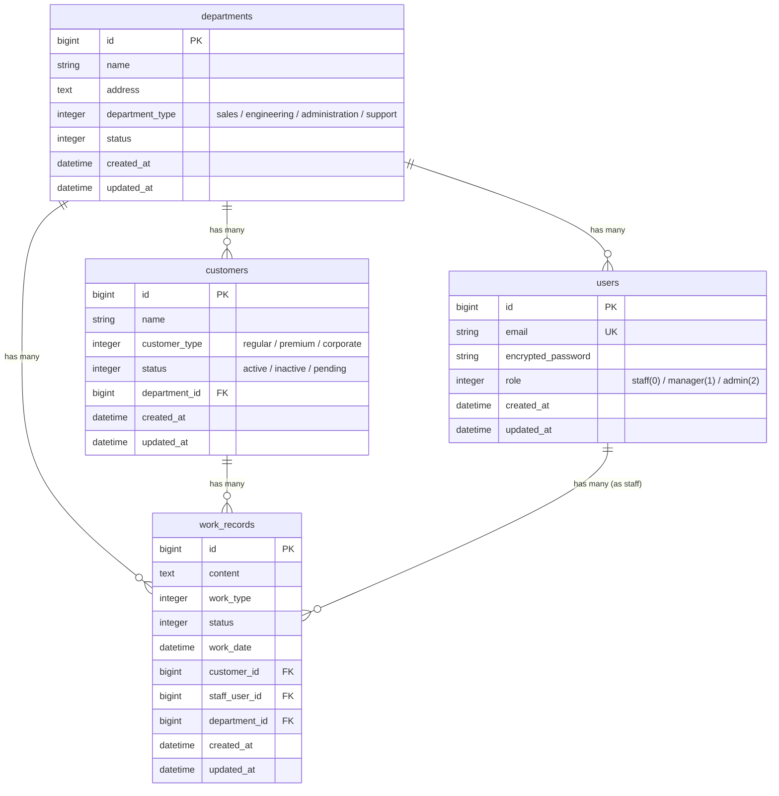

# Portfolio Office Management

## 概要

事業所における業務管理を効率化するWebアプリケーション

現在はMVPとして、
- ログイン認証
- 顧客一覧表示・検索・ページネーション

までを実装しています。

段階的な機能拡張を前提とした設計としており、
今後は顧客CRUDや作業記録管理機能の拡張を想定しています。


## デモ

ログイン → 顧客一覧 → ページ切り替え → 検索 → ログアウト

<video src="https://github.com/user-attachments/assets/5adf1f75-381d-499c-a603-1a401fe12f7f" width="80%" controls></video>


## 技術スタック

### バックエンド

| 技術 | バージョン | 用途 |
|------|-----------|------|
| Ruby | 3.1.4 | 言語 |
| Ruby on Rails | 7.2 | API フレームワーク（API モード） |
| PostgreSQL | 15 | データベース |
| Redis | 7 | キャッシュ / セッションストア |
| Devise + JWT | - | 認証基盤 |
| Kaminari | - | ページネーション |
| RSpec | - | テストフレームワーク |
| RuboCop | - | 静的解析 / コードスタイル |
| Brakeman | - | セキュリティ静的解析 |

### フロントエンド

| 技術 | バージョン | 用途 |
|------|-----------|------|
| React | 19.1 | UI ライブラリ |
| TypeScript | 5.8 | 型安全な開発 |
| Material-UI (MUI) | 7 | UI コンポーネント |
| Vite | 7 | ビルドツール |
| Axios | - | HTTP クライアント |
| React Router | 7 | ルーティング |
| ESLint | 9 | コード品質管理 |

### インフラ / CI

| 技術 | 用途 |
|------|------|
| Docker Compose | 開発環境（PostgreSQL, Redis, PgAdmin, Rails） |
| GitHub Actions | CI パイプライン（RSpec, RuboCop, Brakeman） |

## 主要機能

- **ログイン認証**: JWT によるログイン / ログアウト
- **利用者一覧**: 顧客情報の閲覧・検索・フィルタリング（顧客名・種別・ステータス）
- **ページネーション**: サーバーサイドページネーション（Kaminari）とフロント UI の統合
- **レスポンシブデザイン**: PC・タブレット・スマートフォン対応

## システム設計

### ER 図

業務アプリで一般的なドメイン構造（部署・顧客・スタッフ・作業記録）を前提に、現場運用を想定したER設計としています。



### API エンドポイント

#### 認証

| メソッド | パス | 説明 | フロント |
|---------|------|------|--------|
| POST | `/api/v1/auth/login` | ログイン（JWT トークン発行） | o |
| POST | `/api/v1/auth/signup` | サインアップ | - |
| GET | `/api/v1/auth/me` | ログインユーザー情報取得 | - |
| POST | `/api/v1/auth/logout` | ログアウト | o |
| POST | `/api/v1/auth/refresh` | トークンリフレッシュ | - |

#### 顧客管理

| メソッド | パス | 説明 | フロント |
|---------|------|------|---------|
| GET | `/api/v1/customers` | 顧客一覧（ページネーション対応） | o |
| GET | `/api/v1/customers/:id` | 顧客詳細 | - |
| POST | `/api/v1/customers` | 顧客登録 | - |
| PUT | `/api/v1/customers/:id` | 顧客更新 | - |
| DELETE | `/api/v1/customers/:id` | 顧客削除 | - |

#### ユーザー管理

| メソッド | パス | 説明 | フロント |
|---------|------|------|---------|
| GET | `/api/v1/users` | ユーザー一覧 | - |
| GET | `/api/v1/users/:id` | ユーザー詳細 | - |

> **フロント列**: `o` = フロントエンド画面実装済み、`-` = API のみ（画面未実装）

### 認証・認可フロー

```
1. POST /api/v1/auth/login  →  JWT トークン発行
2. Authorization: Bearer <token> ヘッダーで API リクエスト
3. BaseController で トークン検証 → current_user 設定
4. ロール階層（staff < manager < admin）に基づくアクセス制御
```

## 設計上の意図

本アプリケーションは、業務ドメインを明確にし、
将来的な機能拡張を見据えた構成としています。

- Controllerはリクエスト受付とレスポンス整形に限定し、業務ロジックはモデル・サービス層へ委譲を想定
- 検索・ページネーションはAPI側で処理し、フロントエンドは表示責務に集中
- ロール階層（staff < manager < admin）による認可設計
- 顧客とスタッフの多対多の関係を表現するDB設計

MVP段階では「認証＋顧客一覧」に機能を限定していますが、
拡張前提の構成としています。

## 技術的要素

### カスタムバリデーション基盤

モデルの肥大化を防ぐ目的で、`Validatable` Concernを用いたバリデーション整理も試みています。
エラーメッセージはYAMLで外部管理し、責務分離を意識した構成としています。


### CI パイプライン

GitHub Actions で以下の3ジョブを PR ごとに自動実行しています。

- **scan_ruby**: Brakeman によるセキュリティ脆弱性の静的解析
- **lint**: RuboCop によるコードスタイルチェック
- **test**: RSpec によるテスト実行（PostgreSQL サービスコンテナ使用）

### フロントエンドの認証管理

React Context + Axios interceptor による JWT トークンの自動管理を実装しています。トークンの付与・401 レスポンス時の自動リダイレクトをアプリケーション全体で透過的に処理します。

## セットアップ

### 前提条件

- Docker & Docker Compose
- Node.js 18+
- Git

### バックエンド

```bash
cd backend/
docker-compose up
```

初回起動時はデータベースのセットアップが必要です。

```bash
docker-compose run --rm app rails db:create db:migrate db:seed
```

### フロントエンド

```bash
cd frontend/
npm install
npm run dev
```

`http://localhost:5173` でアクセスできます。Vite のプロキシ設定により、API リクエストは自動的にバックエンド（ポート 3001）に転送されます。

## テスト・静的解析

```bash
cd backend/

# テスト実行
docker-compose run --rm app rspec

# コードスタイルチェック
docker-compose run --rm app rubocop

# セキュリティ解析
docker-compose run --rm app brakeman --no-pager
```

## プロジェクト構成

```
portfolio-office-management/
├── backend/                    # Rails API
│   ├── app/
│   │   ├── controllers/api/v1/ # API コントローラー
│   │   ├── models/             # モデル + Validatable concern
│   │   └── lib/                # JsonWebToken サービス
│   ├── config/
│   │   └── validations/        # バリデーション設定 (YAML)
│   ├── db/                     # マイグレーション / スキーマ
│   ├── spec/                   # RSpec テスト
│   └── docker-compose.yml
├── frontend/                   # React SPA
│   ├── src/
│   │   ├── components/         # UI コンポーネント
│   │   ├── context/            # 認証 Context
│   │   ├── hooks/              # カスタムフック
│   │   ├── services/           # API クライアント (Axios)
│   │   └── types/              # TypeScript 型定義
│   └── vite.config.ts
├── .github/workflows/ci.yml    # GitHub Actions CI
└── README.md
```

## 今後の展望

- 顧客管理の CRUD 画面実装（登録・編集・削除）
- サインアップ画面の実装
- 作業記録（WorkRecord）管理機能のフロントエンド実装
- フロントエンドテスト（Vitest + React Testing Library）の導入
