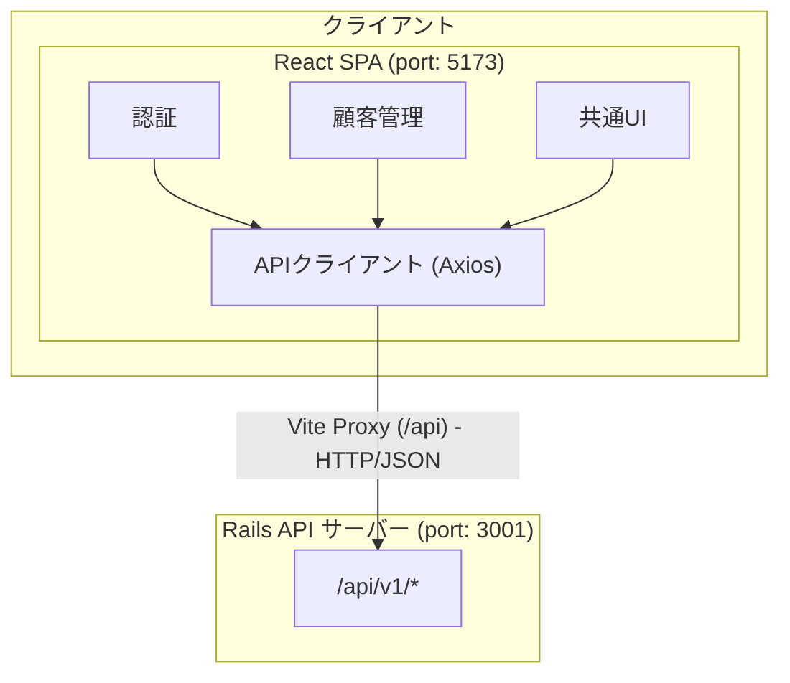
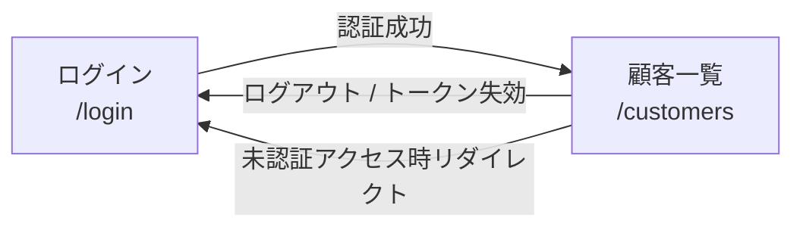
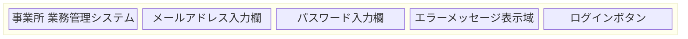
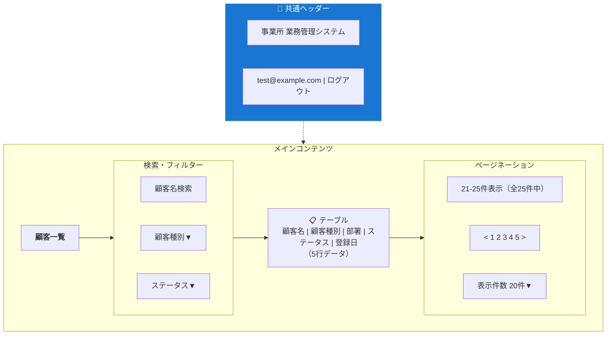
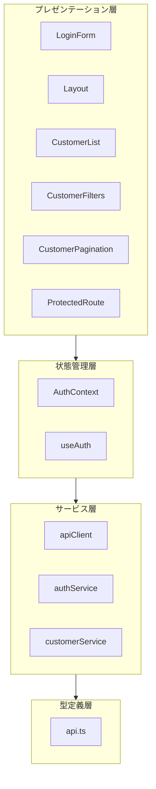
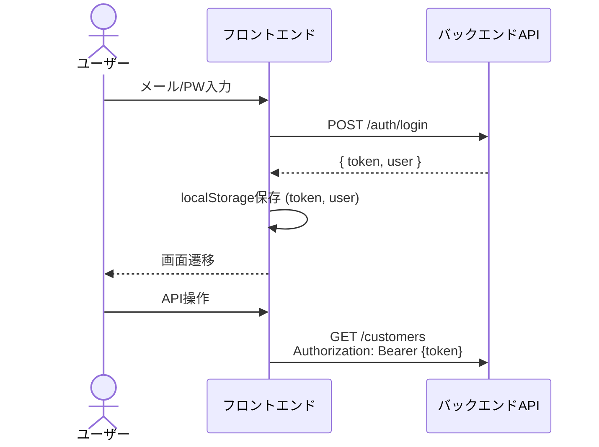

# フロントエンド 基本設計書

## 1. 文書情報

| 項目 | 内容 |
|------|------|
| プロジェクト名 | 事業所 業務管理システム（フロントエンド） |
| 文書種別 | 基本設計書 |
| 作成日 | 2026-02-16 |
| 対象バージョン | 0.0.0 |

---

## 2. システム概要

### 2.1 目的

本システムは、事業所における業務管理を支援するWebアプリケーションのフロントエンド部分である。顧客情報の一覧表示・検索・フィルタリング機能を提供し、JWT認証によるセキュアなアクセス制御を実現する。

### 2.2 システム構成



### 2.3 技術スタック

| カテゴリ | 技術 | バージョン | 用途 |
|---------|------|-----------|------|
| UIフレームワーク | React | 19.1.0 | コンポーネントベースUI構築 |
| 言語 | TypeScript | ~5.8.3 | 型安全な開発 |
| ビルドツール | Vite | 7.0.0 | 開発サーバー・本番ビルド |
| ルーティング | React Router | 7.6.3 | クライアントサイドルーティング |
| UIライブラリ | Material-UI (MUI) | 7.2.0 | UIコンポーネント |
| CSS-in-JS | Emotion | 11.14.x | MUI依存スタイリング |
| HTTPクライアント | Axios | 1.10.0 | API通信 |
| リンター | ESLint | 9.29.0 | コード品質管理 |

---

## 3. 機能一覧

### 3.1 機能概要

| No. | 機能名 | 概要 | 認証要否 |
|-----|--------|------|---------|
| F-001 | ログイン | メールアドレス・パスワードによるJWT認証 | 不要 |
| F-002 | ログアウト | トークン破棄によるセッション終了 | 必要 |
| F-003 | 顧客一覧表示 | 顧客情報のテーブル表示（ページネーション付き） | 必要 |
| F-004 | 顧客検索・フィルタ | 名前検索、顧客種別・ステータスによる絞り込み | 必要 |

### 3.2 画面一覧

| No. | 画面名 | パス | 概要 |
|-----|--------|------|------|
| S-001 | ログイン画面 | `/login` | 認証フォーム |
| S-002 | 顧客一覧画面 | `/customers` | 顧客データの一覧・検索 |

---

## 4. 画面設計

### 4.1 画面遷移図



### 4.2 ログイン画面（S-001）

**レイアウト概要:**



**入力項目:**

| 項目 | 種別 | 必須 | 説明 |
|------|------|------|------|
| メールアドレス | テキスト（email型） | ○ | ユーザーのメールアドレス |
| パスワード | テキスト（password型） | ○ | ユーザーのパスワード |

**動作仕様:**
- ログインボタン押下でAPI認証を実行
- 認証成功時: JWTトークンをlocalStorageに保存し、顧客一覧画面へ遷移
- 認証失敗時: エラーメッセージを画面上部に表示（MUI Alert）
- 送信中: ログインボタンを無効化しローディング状態を表示

### 4.3 顧客一覧画面（S-002）

**レイアウト概要:**



**テーブル表示項目:**

| 列名 | 表示内容 | 備考 |
|------|---------|------|
| 名前 | customer.name | テキスト表示 |
| 種別 | customer.customer_type_display | Chipコンポーネント（premiumは強調色） |
| 部署 | customer.department.name | テキスト表示 |
| ステータス | customer.status_display | Chipコンポーネント（activeは緑色） |
| 登録日 | customer.created_at | 日本語ロケールで日付フォーマット |

**フィルター仕様:**

| フィルター | 種別 | 選択肢 |
|-----------|------|--------|
| 名前検索 | テキスト入力 | 自由入力（部分一致） |
| 顧客種別 | セレクト | すべて / regular / premium / corporate |
| ステータス | セレクト | すべて / active / inactive / pending |

**ページネーション仕様:**

| 項目 | 仕様 |
|------|------|
| 表示件数選択 | 10 / 20 / 50 / 100 件 |
| デフォルト表示件数 | 20件 |
| ページネーション | サーバーサイドページネーション（Kaminari連携） |
| フィルタリング | クライアントサイドで取得済みデータを絞り込み |

---

## 5. アーキテクチャ設計

### 5.1 アプリケーション構造

```
src/
├── main.tsx                    # エントリーポイント
├── App.tsx                     # ルートコンポーネント（ルーティング定義）
├── types/                      # 型定義
│   └── api.ts                  # API関連の型定義
├── context/                    # React Context
│   ├── authContextDef.ts       # 認証コンテキスト型定義
│   └── AuthContext.tsx          # 認証プロバイダー
├── hooks/                      # カスタムフック
│   └── useAuth.ts              # 認証フック
├── services/                   # API通信層
│   └── apiClient.ts            # Axiosクライアント・APIサービス
├── components/                 # UIコンポーネント
│   ├── auth/                   # 認証関連
│   │   └── LoginForm.tsx
│   ├── common/                 # 共通
│   │   ├── Layout.tsx
│   │   └── ProtectedRoute.tsx
│   └── customer/               # 顧客管理
│       ├── CustomerList.tsx
│       ├── CustomerFilters.tsx
│       └── CustomerPagination.tsx
└── styles/                     # スタイルシート
    └── layout.css
```

### 5.2 レイヤー構成



### 5.3 状態管理方針

| 状態種別 | 管理方法 | 対象 |
|---------|---------|------|
| 認証状態（user, token） | React Context API | アプリケーション全体 |
| UIローカル状態 | useState | 各コンポーネント内 |
| API通信状態（loading, error） | useState | 各コンポーネント内 |

Redux等の外部状態管理ライブラリは使用せず、React Context APIによるシンプルな状態管理を採用している。

### 5.4 ルーティング設計

| パス | コンポーネント | ガード | 説明 |
|------|-------------|--------|------|
| `/login` | LoginForm | なし | ログイン画面 |
| `/` | Navigate → `/customers` | なし | リダイレクト |
| `/customers` | Layout > CustomerList | ProtectedRoute | 顧客一覧（認証必須） |

---

## 6. 認証設計

### 6.1 認証フロー



### 6.2 トークン管理

| 項目 | 仕様 |
|------|------|
| 保存場所 | localStorage |
| キー名 | `token`（トークン）、`user`（ユーザー情報JSON） |
| 付与方法 | Axiosリクエストインターセプターで自動付与 |
| 失効処理 | 401レスポンス時にlocalStorageクリア→ログイン画面へリダイレクト |

### 6.3 認可（ロール）

バックエンドで3段階のロール制御を実施:

| ロール | 権限レベル |
|--------|----------|
| staff | 0（一般職員） |
| manager | 1（管理者） |
| admin | 2（システム管理者） |

フロントエンドでは現時点でロールによるUI制御は実装されていない。

---

## 7. API連携設計

### 7.1 APIベースURL

- 開発環境: Viteプロキシ経由 → `http://localhost:3001`
- ベースパス: `/api/v1`

### 7.2 エンドポイント一覧

| メソッド | パス | 用途 | 認証 |
|---------|------|------|------|
| POST | `/api/v1/auth/login` | ログイン | 不要 |
| GET | `/api/v1/auth/me` | ログインユーザー情報取得 | 必要 |
| POST | `/api/v1/auth/signup` | ユーザー登録 | 不要 |
| GET | `/api/v1/customers` | 顧客一覧取得（ページネーション付き） | 必要 |
| GET | `/api/v1/customers/:id` | 顧客詳細取得 | 必要 |
| POST | `/api/v1/customers` | 顧客登録 | 必要 |
| PUT | `/api/v1/customers/:id` | 顧客更新 | 必要 |

### 7.3 エラーハンドリング

| HTTPステータス | フロントエンド処理 |
|-------------|-----------------|
| 200 | 正常処理 |
| 401 | トークンクリア → ログイン画面リダイレクト |
| その他エラー | エラーメッセージをUIに表示 |

---

## 8. UI/UXデザイン方針

### 8.1 デザインシステム

- **UIフレームワーク**: Material-UI (MUI) v7
- **テーマカラー**:
  - Primary: `#1976d2`（青）
  - Secondary: `#dc0004`（赤）
- **スタイリング**: MUI `sx` prop + CSS（レイアウト用）

### 8.2 レスポンシブ対応

| 画面幅 | 対応 |
|--------|------|
| < 1240px | パディング調整 |
| ページコンテナ | 最大幅1200px、中央配置 |
| ログインフォーム | 最大幅480px、中央配置 |

### 8.3 言語

- UIテキストは全て日本語で表示
- エラーメッセージも日本語

---

## 9. 非機能要件

### 9.1 開発環境

| 項目 | 仕様 |
|------|------|
| 開発サーバーポート | 5173 |
| HMR | Vite + React Refresh |
| TypeScript厳密モード | 有効 |
| 未使用変数検出 | 有効（コンパイルエラー） |

### 9.2 ビルド・デプロイ

| コマンド | 用途 |
|---------|------|
| `npm run dev` | 開発サーバー起動 |
| `npm run build` | TypeScript型チェック + Vite本番ビルド |
| `npm run lint` | ESLintによるコード品質チェック |
| `npm run preview` | 本番ビルドのプレビュー |
| `npm run type-check` | TypeScript型チェックのみ |

### 9.3 セキュリティ

| 項目 | 対策 |
|------|------|
| 認証トークン | JWT、localStorage保存 |
| 自動ログアウト | 401レスポンス時にトークン破棄 |
| ルート保護 | ProtectedRouteコンポーネントによるガード |
| CORS | Viteプロキシで開発時のCORSを回避 |
