# フロントエンド 詳細設計書

## 1. 文書情報

| 項目 | 内容 |
|------|------|
| プロジェクト名 | 事業所 業務管理システム（フロントエンド） |
| 文書種別 | 詳細設計書 |
| 作成日 | 2026-02-16 |
| 対象バージョン | 0.0.0 |

---

## 2. 型定義

### 2.1 APIレスポンス型（`src/types/api.ts`）

#### User

```typescript
export interface User {
  id: number;
  email: string;
  role: 'staff' | 'manager' | 'admin';
  created_at: string;
  updated_at: string;
}
```

| プロパティ | 型 | 説明 |
|-----------|-----|------|
| id | number | ユーザーID |
| email | string | メールアドレス |
| role | `'staff' \| 'manager' \| 'admin'` | ユーザーロール |
| created_at | string | 作成日時（ISO 8601） |
| updated_at | string | 更新日時（ISO 8601） |

#### Customer

```typescript
export interface Customer {
  id: number;
  name: string;
  customer_type: 'regular' | 'premium' | 'corporate';
  customer_type_display: string;
  status: 'active' | 'inactive' | 'pending';
  status_display: string;
  department: Department;
  created_at: string;
  updated_at: string;
}
```

| プロパティ | 型 | 説明 |
|-----------|-----|------|
| id | number | 顧客ID |
| name | string | 顧客名 |
| customer_type | `'regular' \| 'premium' \| 'corporate'` | 顧客種別（内部値） |
| customer_type_display | string | 顧客種別（表示用日本語ラベル） |
| status | `'active' \| 'inactive' \| 'pending'` | ステータス（内部値） |
| status_display | string | ステータス（表示用日本語ラベル） |
| department | Department | 所属部署オブジェクト |
| created_at | string | 登録日時 |
| updated_at | string | 更新日時 |

#### Department

```typescript
export interface Department {
  id: number;
  name: string;
}
```

#### PaginationInfo

```typescript
export interface PaginationInfo {
  current_page: number;
  total_pages: number;
  total_count: number;
}
```

| プロパティ | 型 | 説明 |
|-----------|-----|------|
| current_page | number | 現在のページ番号 |
| total_pages | number | 総ページ数 |
| total_count | number | 総レコード数 |

#### CustomersResponse

```typescript
export interface CustomersResponse {
  customers: Customer[];
  pagination: PaginationInfo;
}
```

#### AuthResponse

```typescript
export interface AuthResponse {
  token: string;
  user: User;
  expires_at: string;
}
```

#### ApiError

```typescript
export interface ApiError {
  error: string;
  errors?: string[];
}
```

---

## 3. サービス層詳細設計

### 3.1 APIクライアント（`src/services/apiClient.ts`）

#### Axiosインスタンス設定

```typescript
const apiClient = axios.create({
  baseURL: "/api/v1",
  headers: { "Content-Type": "application/json" },
});
```

| 設定項目 | 値 | 説明 |
|---------|-----|------|
| baseURL | `/api/v1` | APIベースパス（Viteプロキシ経由） |
| Content-Type | `application/json` | JSON形式で通信 |

#### リクエストインターセプター

**処理フロー:**

1. リクエスト送信前にlocalStorageから`token`を取得
2. トークンが存在する場合、`Authorization: Bearer {token}`ヘッダーを付与
3. トークンが存在しない場合、ヘッダーなしでリクエスト送信
4. エラー発生時はPromise.rejectで伝播

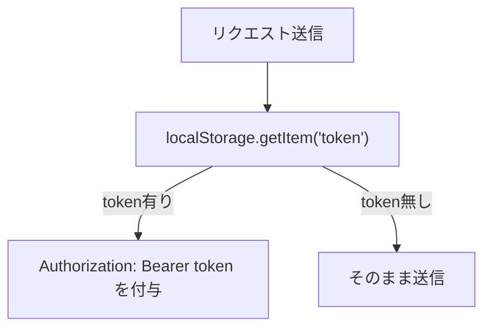
```mermaid
flowchart TD
    A["リクエスト送信"] --> B["localStorage.getItem('token')"]
    B -->|"token有り"| C["Authorization: Bearer token を付与"]
    B -->|"token無し"| D["そのまま送信"]
```

#### レスポンスインターセプター

**処理フロー:**

1. 正常レスポンス: そのまま返却
2. 401エラー: localStorage内の`token`と`user`を削除 → `/login`へリダイレクト
3. その他エラー: Promise.rejectで伝播

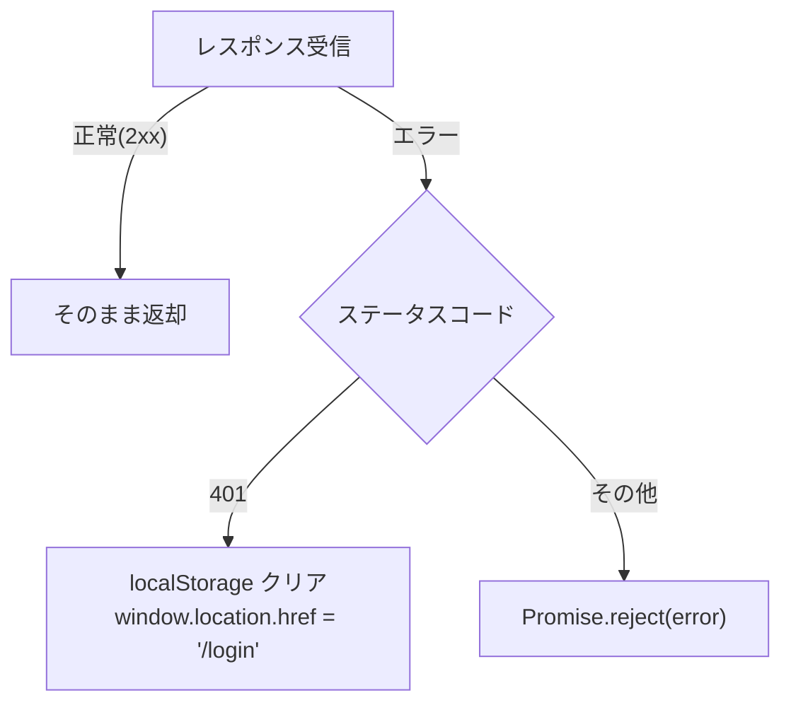
```mermaid
flowchart TD
    A["レスポンス受信"] -->|"正常(2xx)"| B["そのまま返却"]
    A -->|"エラー"| C{"ステータスコード"}
    C -->|"401"| D["localStorage クリア\nwindow.location.href = '/login'"]
    C -->|"その他"| E["Promise.reject(error)"]
```

### 3.2 認証サービス（authService）

| メソッド | HTTPメソッド | パス | パラメータ | レスポンス型 |
|---------|------------|------|-----------|------------|
| login | POST | `/auth/login` | `{ email: string, password: string }` | `AuthResponse` |
| me | GET | `/auth/me` | なし | `{ user: User }` |
| signup | POST | `/auth/signup` | `{ email: string, password: string, password_confirmation: string }` | - |

### 3.3 顧客サービス（customerService）

| メソッド | HTTPメソッド | パス | パラメータ | レスポンス型 |
|---------|------------|------|-----------|------------|
| getAll | GET | `/customers` | `{ page?: number, per_page?: number }` | `CustomersResponse` |
| getById | GET | `/customers/:id` | `id: number` | `{ customer: Customer }` |
| create | POST | `/customers` | `Omit<Customer, 'id'\|'created_at'\|'updated_at'\|'department'>` | `{ customer: Customer }` |
| update | PUT | `/customers/:id` | `id: number, Partial<Customer>` | `{ customer: Customer }` |

---

## 4. 状態管理詳細設計

### 4.1 認証コンテキスト型定義（`src/context/authContextDef.ts`）

```typescript
export interface AuthContextType {
    user: User | null;
    token: string | null;
    loading: boolean;
    login: (email: string, password: string) => Promise<{ success: boolean; error?: string }>;
    logout: () => void;
}
```

| プロパティ | 型 | 説明 |
|-----------|-----|------|
| user | `User \| null` | ログイン中のユーザー情報（未認証時null） |
| token | `string \| null` | JWTトークン（未認証時null） |
| loading | boolean | 初期化中フラグ |
| login | function | ログイン関数 |
| logout | function | ログアウト関数 |

**設計意図:** `authContextDef.ts`として型定義を分離しているのは、React Fast Refreshの制約回避のためである。コンテキストの型定義を別ファイルにすることで、プロバイダーの変更時に不要な再レンダリングを防止する。

### 4.2 認証プロバイダー（`src/context/AuthContext.tsx`）

#### 内部状態

| 状態 | 型 | 初期値 | 説明 |
|------|-----|--------|------|
| user | `User \| null` | null | ログインユーザー |
| token | `string \| null` | null | JWTトークン |
| loading | boolean | true | 初期化中フラグ |

#### 初期化処理（useEffect）

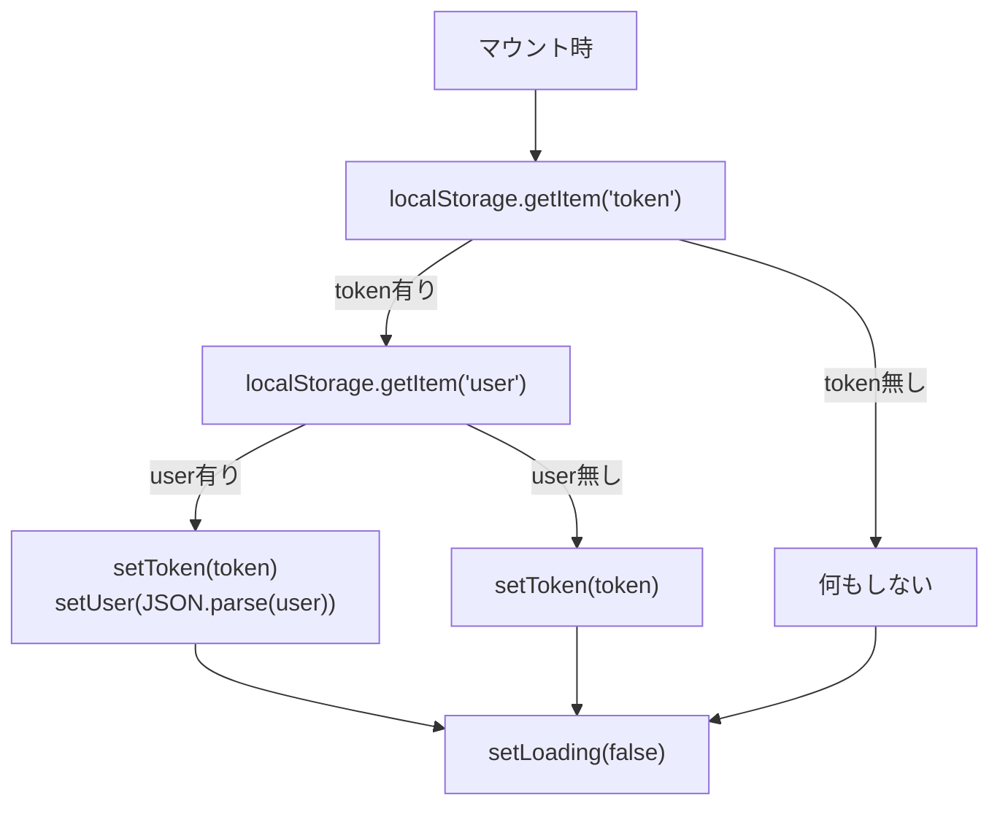
```mermaid
flowchart TD
    A["マウント時"] --> B["localStorage.getItem('token')"]
    B -->|"token有り"| C["localStorage.getItem('user')"]
    B -->|"token無し"| F["何もしない"]
    C -->|"user有り"| D["setToken(token)\nsetUser(JSON.parse(user))"]
    C -->|"user無し"| E["setToken(token)"]
    D --> G["setLoading(false)"]
    E --> G
    F --> G
```

#### login関数

**引数:** `email: string, password: string`
**戻り値:** `Promise<{ success: boolean; error?: string }>`

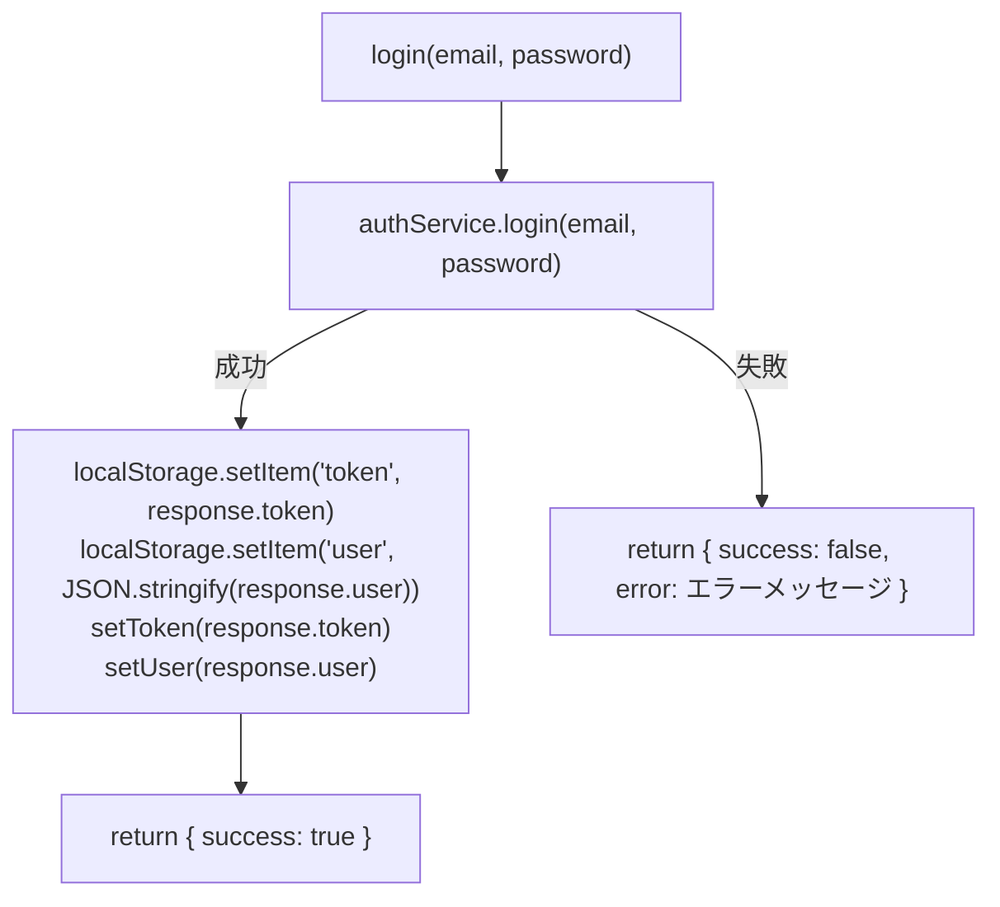
```mermaid
flowchart TD
    A["login(email, password)"] --> B["authService.login(email, password)"]
    B -->|"成功"| C["localStorage.setItem('token', response.token)\nlocalStorage.setItem('user', JSON.stringify(response.user))\nsetToken(response.token)\nsetUser(response.user)"]
    C --> D["return { success: true }"]
    B -->|"失敗"| E["return { success: false, error: エラーメッセージ }"]
```

#### logout関数

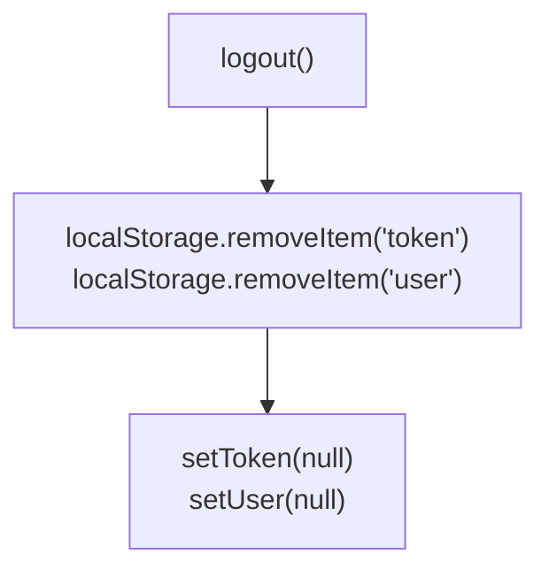
```mermaid
flowchart TD
    A["logout()"] --> B["localStorage.removeItem('token')\nlocalStorage.removeItem('user')"]
    B --> C["setToken(null)\nsetUser(null)"]
```

### 4.3 useAuthフック（`src/hooks/useAuth.ts`）

```typescript
export const useAuth = (): AuthContextType => {
    const context = useContext(AuthContext);
    if (!context) {
        throw new Error('useAuth must be used within an AuthProvider');
    }
    return context;
};
```

- AuthProvider外で使用された場合、Errorをthrow
- AuthContextType型を返却

---

## 5. コンポーネント詳細設計

### 5.1 App（`src/App.tsx`）

**役割:** アプリケーションのルートコンポーネント。テーマ・認証・ルーティングを統括する。

**コンポーネントツリー:**

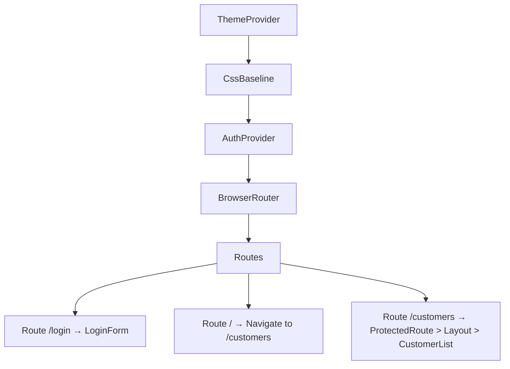
```mermaid
graph TD
    TP["ThemeProvider"] --> CB["CssBaseline"]
    CB --> AP["AuthProvider"]
    AP --> BR["BrowserRouter"]
    BR --> Routes["Routes"]
    Routes --> R1["Route /login → LoginForm"]
    Routes --> R2["Route / → Navigate to /customers"]
    Routes --> R3["Route /customers → ProtectedRoute > Layout > CustomerList"]
```

**MUIテーマ設定:**

```typescript
const theme = createTheme({
    palette: {
        primary: { main: '#1976d2' },
        secondary: { main: '#dc0004' }
    }
});
```

---

### 5.2 LoginForm（`src/components/auth/LoginForm.tsx`）

**役割:** ログインフォームを表示し、認証処理を行う。

**依存:**
- `useAuth()` - login関数
- `useNavigate()` - 画面遷移

**内部状態:**

| 状態 | 型 | 初期値 | 説明 |
|------|-----|--------|------|
| email | string | `''` | メールアドレス入力値 |
| password | string | `''` | パスワード入力値 |
| error | string | `''` | エラーメッセージ |
| loading | boolean | false | 送信中フラグ |

**処理フロー（handleSubmit）:**

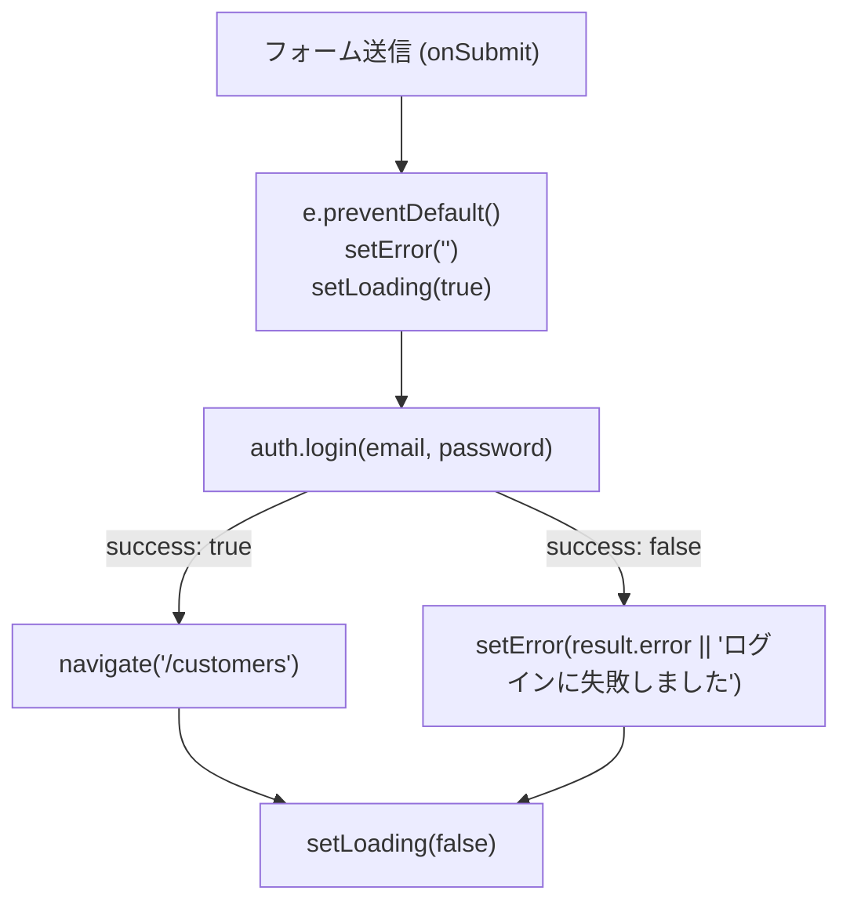
```mermaid
flowchart TD
    A["フォーム送信 (onSubmit)"] --> B["e.preventDefault()\nsetError('')\nsetLoading(true)"]
    B --> C["auth.login(email, password)"]
    C -->|"success: true"| D["navigate('/customers')"]
    C -->|"success: false"| E["setError(result.error || 'ログインに失敗しました')"]
    D --> F["setLoading(false)"]
    E --> F
```

**レンダリング仕様:**

| 要素 | MUIコンポーネント | 属性 |
|------|-----------------|------|
| 外枠 | Container | maxWidth="sm" |
| カード | Paper | elevation=3, p=4 |
| タイトル | Typography | variant="h4", align="center" |
| メールアドレス欄 | TextField | type="email", required, fullWidth |
| パスワード欄 | TextField | type="password", required, fullWidth |
| エラー表示 | Alert | severity="error"（error存在時のみ表示） |
| 送信ボタン | Button | type="submit", variant="contained", fullWidth, disabled={loading} |

---

### 5.3 Layout（`src/components/common/Layout.tsx`）

**役割:** 認証済みページの共通レイアウト（ヘッダー + コンテンツエリア）を提供する。

**Props:**

```typescript
interface LayoutProps {
    children: ReactNode;
}
```

**依存:**
- `useAuth()` - user, logout
- `useNavigate()` - 画面遷移

**レンダリング構造:**

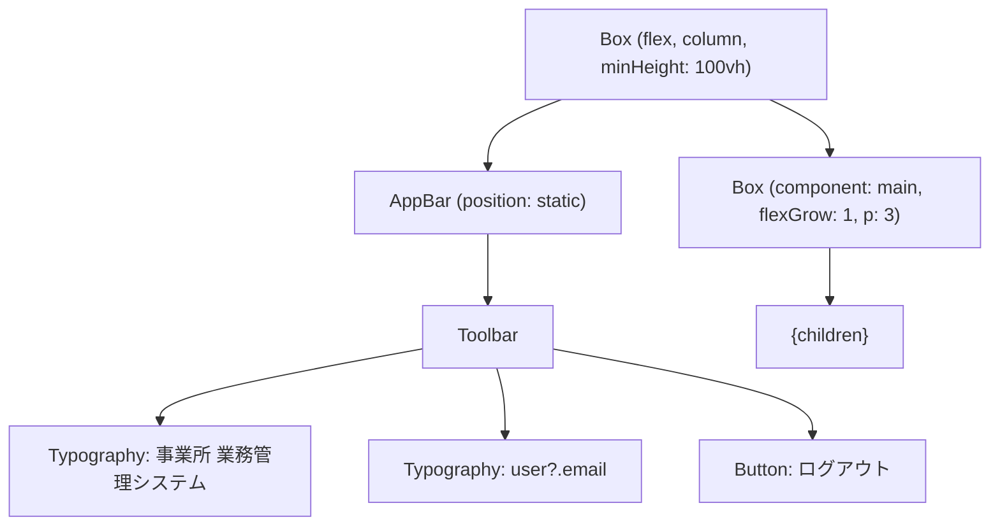
```mermaid
graph TD
    Root["Box (flex, column, minHeight: 100vh)"]
    Root --> AppBar["AppBar (position: static)"]
    Root --> Main["Box (component: main, flexGrow: 1, p: 3)"]
    AppBar --> Toolbar["Toolbar"]
    Toolbar --> Title["Typography: 事業所 業務管理システム"]
    Toolbar --> Email["Typography: user?.email"]
    Toolbar --> Logout["Button: ログアウト"]
    Main --> Children["{children}"]
```

**handleLogout処理:**

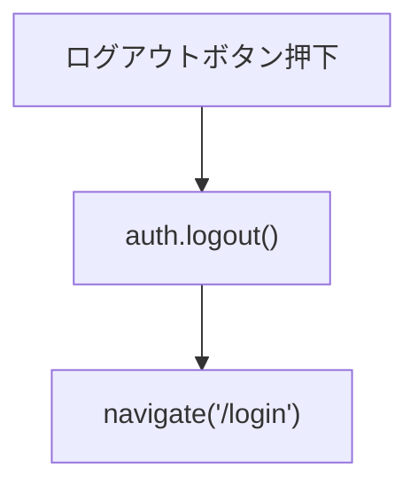
```mermaid
flowchart TD
    A["ログアウトボタン押下"] --> B["auth.logout()"] --> C["navigate('/login')"]
```

---

### 5.4 ProtectedRoute（`src/components/common/ProtectedRoute.tsx`）

**役割:** 認証状態に基づきルートアクセスを制御するガードコンポーネント。

**Props:**

```typescript
interface ProtectedRouteProps {
    children: ReactNode;
}
```

**依存:**
- `useAuth()` - token, loading

**分岐ロジック:**

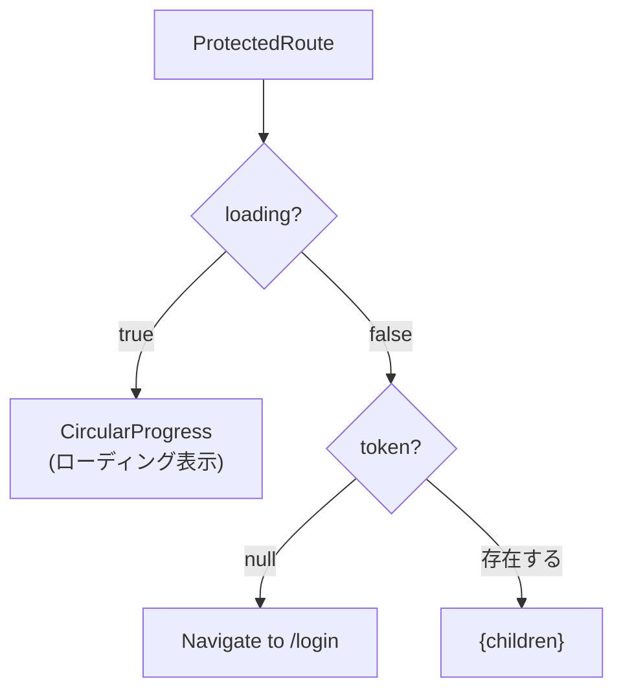
```mermaid
flowchart TD
    A["ProtectedRoute"] --> B{"loading?"}
    B -->|"true"| C["CircularProgress\n(ローディング表示)"]
    B -->|"false"| D{"token?"}
    D -->|"null"| E["Navigate to /login"]
    D -->|"存在する"| F["{children}"]
```

---

### 5.5 CustomerList（`src/components/customer/CustomerList.tsx`）

**役割:** 顧客一覧のメイン画面。データ取得・フィルタリング・テーブル表示を管理する。

**内部状態:**

| 状態 | 型 | 初期値 | 説明 |
|------|-----|--------|------|
| customersData | `CustomersResponse \| null` | null | API取得データ |
| loading | boolean | true | データ取得中フラグ |
| error | `string \| null` | null | エラーメッセージ |
| page | number | 1 | 現在ページ |
| perPage | number | 20 | 1ページあたりの表示件数 |
| filters | FilterState | `{ searchName: '', customerType: '', status: '' }` | フィルター状態 |

**FilterState型:**

```typescript
interface FilterState {
    searchName: string;
    customerType: string;
    status: string;
}
```

**データ取得処理（useEffect）:**

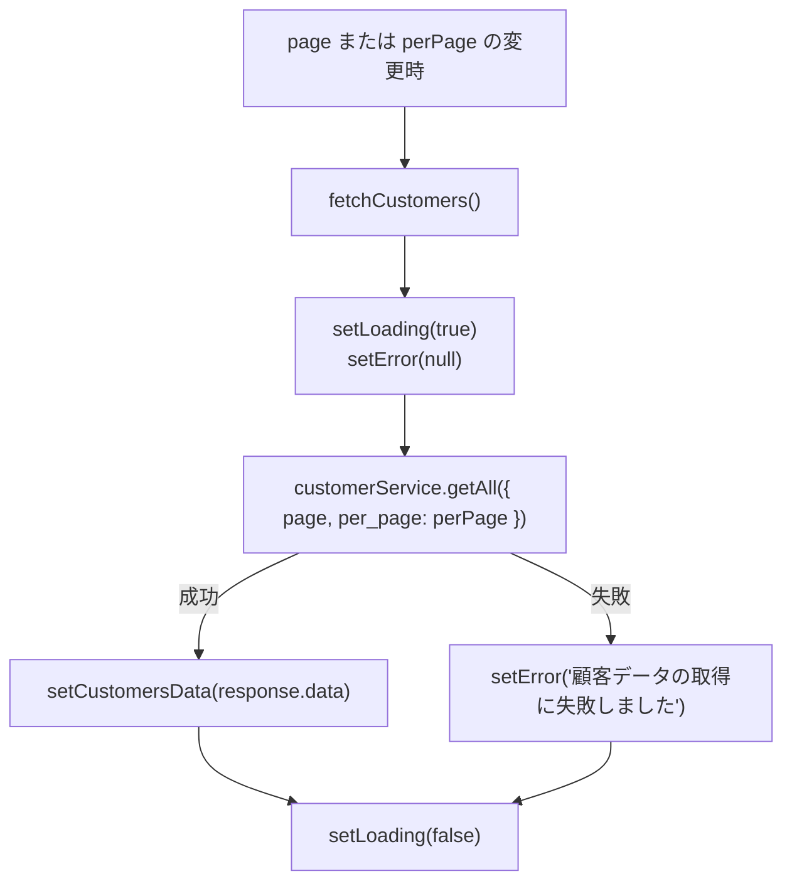
```mermaid
flowchart TD
    A["page または perPage の変更時"] --> B["fetchCustomers()"]
    B --> C["setLoading(true)\nsetError(null)"]
    C --> D["customerService.getAll({ page, per_page: perPage })"]
    D -->|"成功"| E["setCustomersData(response.data)"]
    D -->|"失敗"| F["setError('顧客データの取得に失敗しました')"]
    E --> G["setLoading(false)"]
    F --> G
```

**クライアントサイドフィルタリング:**

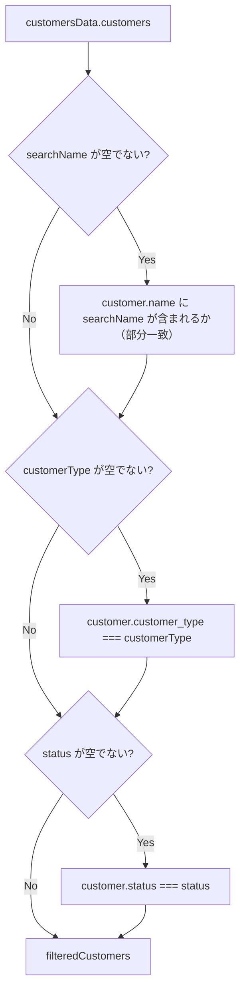
```mermaid
flowchart TD
    A["customersData.customers"] --> B{"searchName が空でない?"}
    B -->|"Yes"| C["customer.name に searchName が含まれるか（部分一致）"]
    B -->|"No"| D{"customerType が空でない?"}
    C --> D
    D -->|"Yes"| E["customer.customer_type === customerType"]
    D -->|"No"| F{"status が空でない?"}
    E --> F
    F -->|"Yes"| G["customer.status === status"]
    F -->|"No"| H["filteredCustomers"]
    G --> H
```

**テーブル列仕様:**

| 列 | データソース | 表示方法 | 補足 |
|----|------------|---------|------|
| 名前 | customer.name | TableCell（テキスト） | - |
| 種別 | customer.customer_type_display | Chip | premium: color="warning" |
| 部署 | customer.department.name | TableCell（テキスト） | - |
| ステータス | customer.status_display | Chip | active: color="success" |
| 登録日 | customer.created_at | TableCell（テキスト） | `new Date().toLocaleDateString('ja-JP')` |

**表示状態の分岐:**

| 条件 | 表示内容 |
|------|---------|
| loading === true | CircularProgress（中央配置） |
| error !== null | Alert severity="error" + メッセージ |
| filteredCustomers.length === 0 | Alert severity="info" + "顧客データがありません" |
| フィルター適用中 | フィルター適用中Chip + 件数表示 |
| 通常 | テーブル + ページネーション |

---

### 5.6 CustomerFilters（`src/components/customer/CustomerFilters.tsx`）

**役割:** 顧客一覧のフィルター・検索UIを提供する。

**Props:**

```typescript
interface CustomerFiltersProps {
    filters: FilterState;
    onFiltersChange: (filters: FilterState) => void;
}
```

**レンダリング構造:**

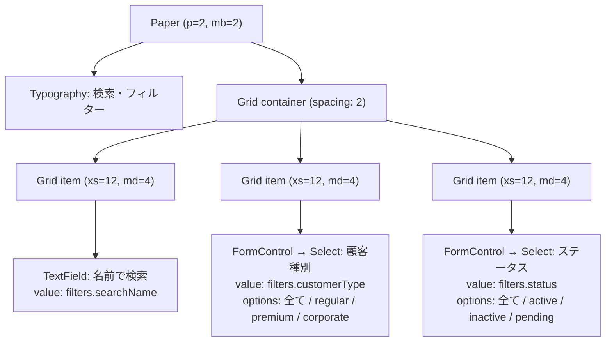
```mermaid
graph TD
    Paper["Paper (p=2, mb=2)"] --> Title["Typography: 検索・フィルター"]
    Paper --> Grid["Grid container (spacing: 2)"]
    Grid --> G1["Grid item (xs=12, md=4)"]
    Grid --> G2["Grid item (xs=12, md=4)"]
    Grid --> G3["Grid item (xs=12, md=4)"]
    G1 --> TF["TextField: 名前で検索\nvalue: filters.searchName"]
    G2 --> FC1["FormControl → Select: 顧客種別\nvalue: filters.customerType\noptions: 全て / regular / premium / corporate"]
    G3 --> FC2["FormControl → Select: ステータス\nvalue: filters.status\noptions: 全て / active / inactive / pending"]
```

**ヘルパー関数:**

```typescript
// 顧客種別の表示名変換
getCustomerTypeDisplay(type: string): string
  'regular'    → '一般'
  'premium'    → 'プレミアム'
  'corporate'  → '法人'

// ステータスの表示名変換
getStatusDisplay(status: string): string
  'active'   → '有効'
  'inactive'  → '無効'
  'pending'   → '保留中'
```

**適用中フィルター表示:**

フィルターが1つ以上適用されている場合、フィルター内容をグレー背景のBoxに表示:
- `searchName`: 「名前: {value}」
- `customerType`: 「種別: {getCustomerTypeDisplay(value)}」
- `status`: 「ステータス: {getStatusDisplay(value)}」

---

### 5.7 CustomerPagination（`src/components/customer/CustomerPagination.tsx`）

**役割:** ページネーションUIを提供する。

**Props:**

```typescript
interface CustomerPaginationProps {
    pagination: PaginationInfo;
    perPage: number;
    onPageChange: (page: number) => void;
    onPerPageChange: (perPage: number) => void;
    isLoading?: boolean;
}
```

**表示条件:**
- `pagination`が未定義または`total_count === 0`の場合、`null`を返却（非表示）

**レンダリング構造:**

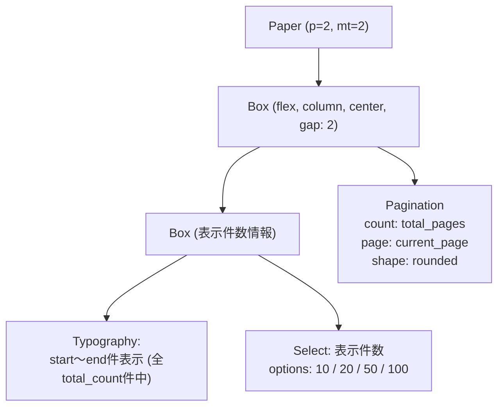
```mermaid
graph TD
    Paper["Paper (p=2, mt=2)"] --> Box["Box (flex, column, center, gap: 2)"]
    Box --> Info["Box (表示件数情報)"]
    Box --> Pag["Pagination\ncount: total_pages\npage: current_page\nshape: rounded"]
    Info --> Typ["Typography:\nstart〜end件表示 (全total_count件中)"]
    Info --> Sel["Select: 表示件数\noptions: 10 / 20 / 50 / 100"]
```

**表示件数の計算:**

```
start = (current_page - 1) * perPage + 1
end   = Math.min(current_page * perPage, total_count)
```

---

## 6. スタイル詳細設計

### 6.1 グローバルCSS（`src/index.css`）

Viteデフォルトテンプレートのスタイル。ライト/ダークモード対応のカラースキーム設定を含む。

### 6.2 レイアウトCSS（`src/styles/layout.css`）

| セレクタ | プロパティ | 値 | 説明 |
|---------|-----------|-----|------|
| `#root` | width | 100% | ルート要素を全幅に |
| `.page-container` | max-width | 1200px | コンテンツ最大幅 |
| `.page-container` | margin | 0 auto | 中央配置 |
| `.page-container` | padding | 0 24px | 左右余白 |
| `.page-container` | min-height | 100vh | 最低画面高さ |
| `.login-container` | max-width | 480px | ログインフォーム最大幅 |
| `.login-container` | margin | 0 auto | 中央配置 |
| `.customer-table-container` | max-height | 600px | テーブルスクロール域 |
| `.customer-table-container` | overflow | auto | スクロール有効化 |

**メディアクエリ:**

```css
@media (max-width: 1240px) {
  .page-container {
    padding: 0 16px;  /* 狭い画面でパディング縮小 */
  }
}
```

### 6.3 MUI sxプロパティによるインラインスタイル

各コンポーネントでMUIの`sx`プロパティを使用してスタイリング:

- **LoginForm:** Paper要素にelevation=3, padding=4
- **Layout:** AppBarはstatic配置、メインコンテンツにpading=3
- **CustomerList:** テーブルにstickyヘッダー
- **CustomerFilters:** Paper要素にpadding=2, marginBottom=2
- **CustomerPagination:** Paper要素にpadding=2, marginTop=2

---

## 7. エントリーポイント（`src/main.tsx`）

```typescript
import { StrictMode } from 'react'
import { createRoot } from 'react-dom/client'
import './index.css'
import App from './App.tsx'
import './styles/layout.css'

createRoot(document.getElementById('root')!).render(
  <StrictMode>
    <App />
  </StrictMode>,
)
```

**処理:**

1. `#root` DOM要素を取得
2. React 19のcreateRoot APIでルートを作成
3. StrictModeでAppコンポーネントをレンダリング
4. グローバルCSS（`index.css`, `layout.css`）をインポート

---

## 8. ビルド設定詳細

### 8.1 Vite設定（`vite.config.ts`）

```typescript
export default defineConfig({
  plugins: [react()],
  server: {
    port: 5173,
    proxy: {
      '/api': {
        target: 'http://localhost:3001',
        changeOrigin: true
      }
    }
  }
})
```

| 設定 | 値 | 説明 |
|------|-----|------|
| plugins | react() | React JSXトランスフォーム + Fast Refresh |
| server.port | 5173 | 開発サーバーポート |
| server.proxy./api.target | http://localhost:3001 | APIプロキシ先 |
| server.proxy./api.changeOrigin | true | Origin書き換え有効 |

### 8.2 TypeScript設定（`tsconfig.app.json`）

| 設定 | 値 | 説明 |
|------|-----|------|
| target | ES2022 | 出力ターゲット |
| module | ESNext | モジュールシステム |
| moduleResolution | bundler | バンドラー向け解決 |
| jsx | react-jsx | 新JSXトランスフォーム |
| strict | true | 厳密モード全有効 |
| noUnusedLocals | true | 未使用ローカル変数エラー |
| noUnusedParameters | true | 未使用パラメータエラー |
| noEmit | true | TSはビルド出力しない（Viteが担当） |

### 8.3 ESLint設定（`eslint.config.js`）

| プラグイン | 用途 |
|-----------|------|
| @eslint/js | JavaScript基本ルール |
| typescript-eslint | TypeScript用ルール |
| react-hooks | Reactフックルール（依存配列チェック等） |
| react-refresh | Fast Refreshとの互換性チェック |

---

## 9. コンポーネント依存関係図

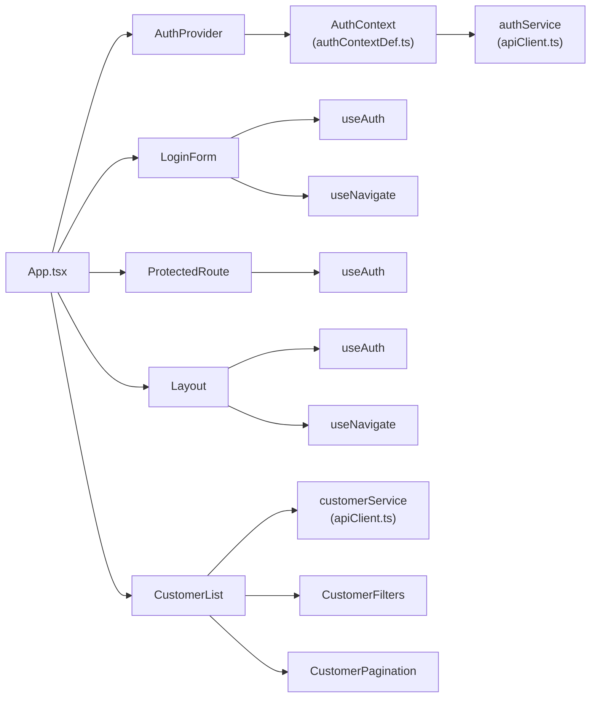
```mermaid
graph LR

    App["App.tsx"]

    App --> AP["AuthProvider"]
    App --> LF["LoginForm"]
    App --> PR["ProtectedRoute"]
    App --> LO["Layout"]
    App --> CL["CustomerList"]

    AP --> AC["AuthContext\n(authContextDef.ts)"]
    AC --> AS["authService\n(apiClient.ts)"]

    LF --> UA1["useAuth"]
    LF --> UN1["useNavigate"]

    PR --> UA2["useAuth"]

    LO --> UA3["useAuth"]
    LO --> UN2["useNavigate"]

    CL --> CS["customerService\n(apiClient.ts)"]
    CL --> CF["CustomerFilters"]
    CL --> CP["CustomerPagination"]
```

---

## 10. データフロー図

### 10.1 認証データフロー

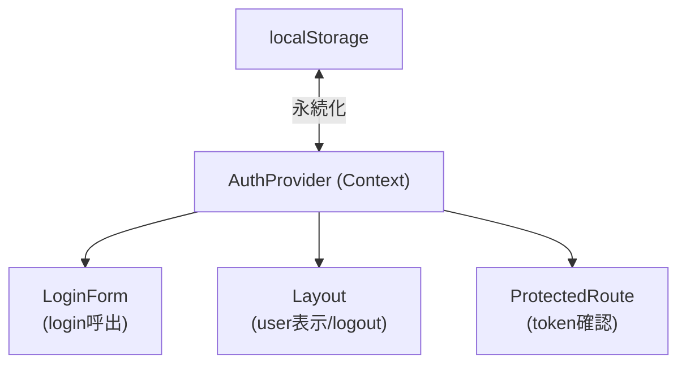
```mermaid
graph TD
    LS["localStorage"] <-->|"永続化"| AP["AuthProvider (Context)"]
    AP --> LF["LoginForm\n(login呼出)"]
    AP --> LO["Layout\n(user表示/logout)"]
    AP --> PR["ProtectedRoute\n(token確認)"]
```

### 10.2 顧客データフロー

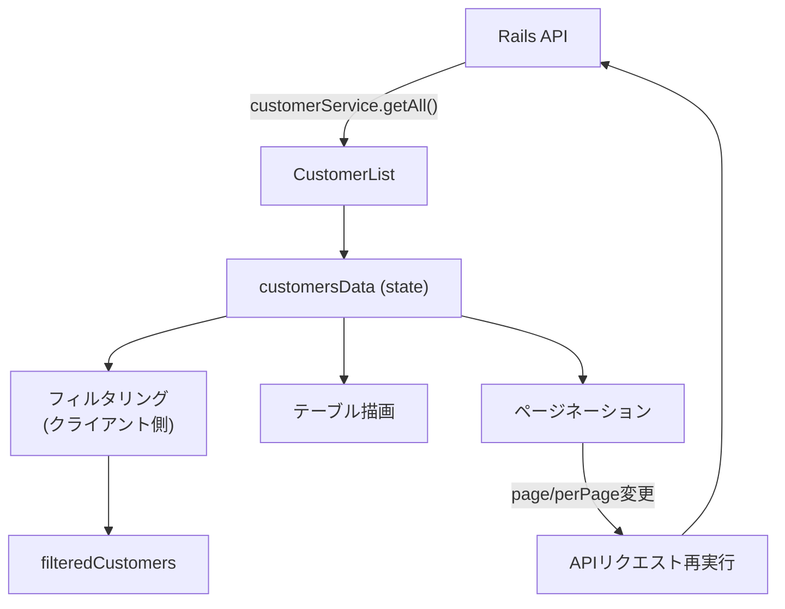
```mermaid
flowchart TD
    API["Rails API"] -->|"customerService.getAll()"| CL["CustomerList"]
    CL --> State["customersData (state)"]
    State --> Filter["フィルタリング\n(クライアント側)"]
    State --> Table["テーブル描画"]
    State --> Pag["ページネーション"]
    Filter --> Filtered["filteredCustomers"]
    Pag -->|"page/perPage変更"| Refetch["APIリクエスト再実行"]
    Refetch --> API
```

---

## 11. エラーハンドリング一覧

| 発生箇所 | エラー種別 | 処理 |
|---------|-----------|------|
| LoginForm | ログイン失敗（認証エラー） | Alert severity="error" でメッセージ表示 |
| LoginForm | ログイン失敗（通信エラー） | 「ログインに失敗しました」をAlert表示 |
| CustomerList | 顧客データ取得失敗 | Alert severity="error" でメッセージ表示 |
| Axiosインターセプター | 401 Unauthorized | localStorage クリア → /login リダイレクト |
| useAuth | AuthProvider外での使用 | Error throw: "useAuth must be used within an AuthProvider" |
